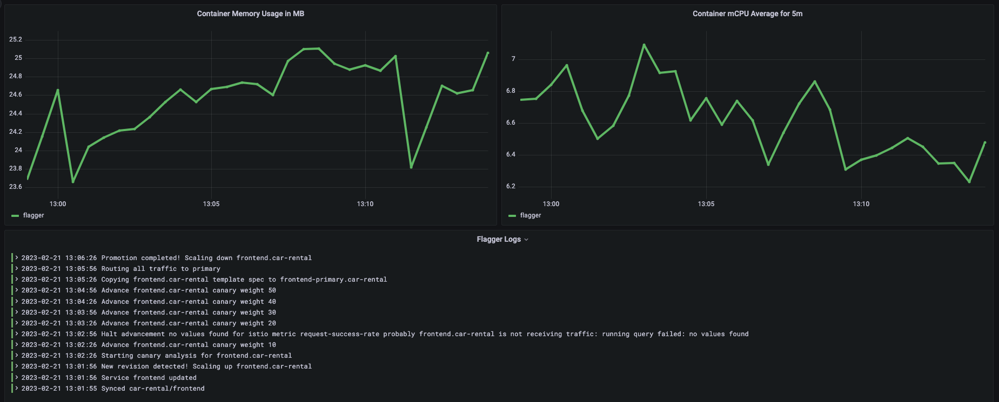
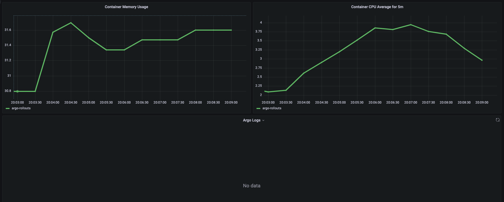
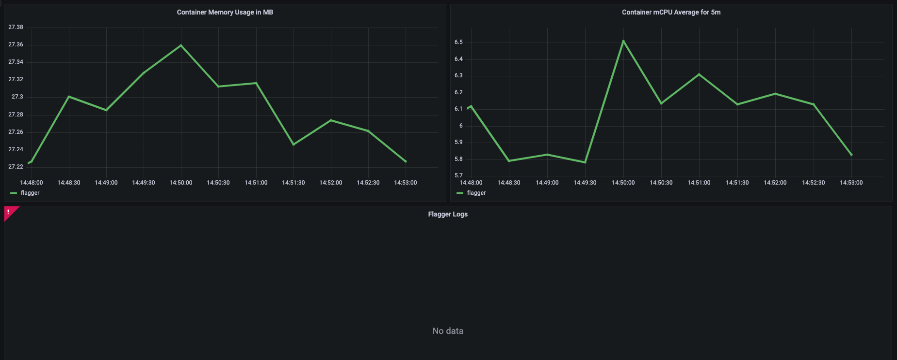
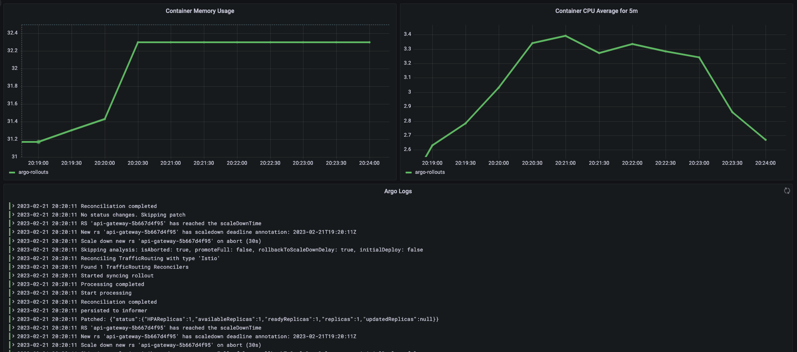
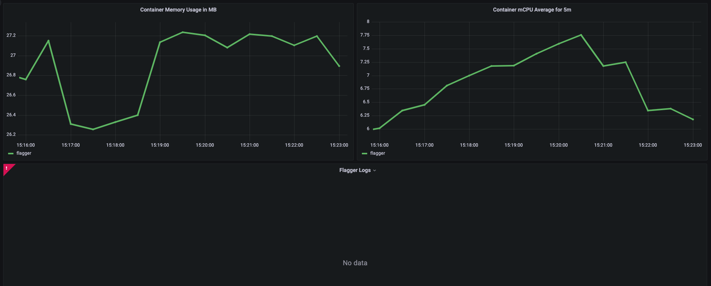
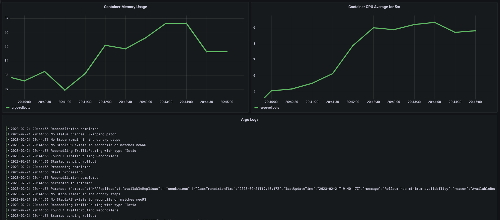
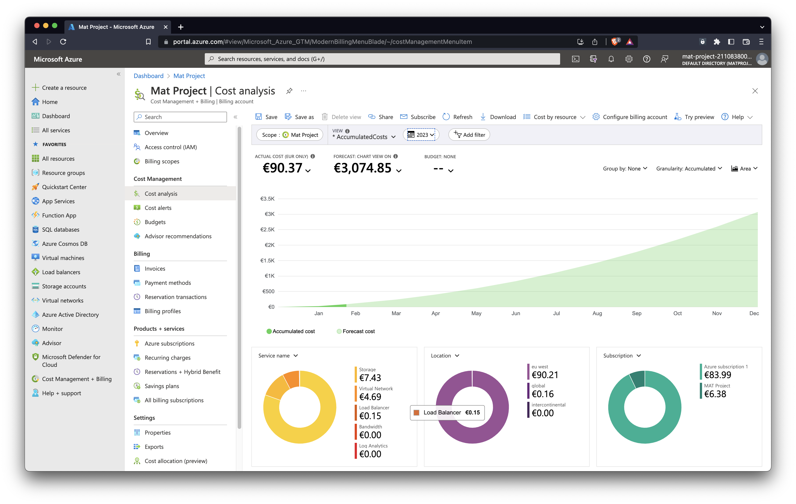

= Master Thesis Project Report: Comparison of Canary Deployment tools
Nichil Strasser<nichil.strasser@stud.fh-campuswien.ac.at>, 25.02.2023
:reproducible:
:listing-caption: Listing
:source-highlighter: rouge
:toc:
// Uncomment next line to add a title page (or set doctype to book)
:title-page:
// Uncomment next line to set page size (default is A4)
:pdf-page-size: Letter

== Introduction
The pace of today's software development and delivery is constantly increasing. This is possible because of the existence of many different tools and techniques. Starting from collaboration techniques in teams over software architecture models to deployment techniques on the field. Mostly these are used for the common goal to speed up the software development delivery cycle. 

One of those techniques is called the Canary Deployment, which is used to roll out new versions of software. It is used as part of Continuous Delivery. This report will give you an introduction to that specific deployment type. During the third term of Software Development and Engineering Study a Master Thesis Project had to be carried out, so this report focuses on the setup details and result of the same. 

The Master Thesis Project is about comparing tools which are used to execute Canary Deployments, a deployment method for new software releases. Basically it consists of gradually rolling out a newer version of a software component, also called "Canary", to a small percentage of users. Step by step more and more users are routed onto the Canary. Each step is accompanied by a constant examination of metrics evaluation. If the metrics fall under a specified threshold the Canary is stopped, users routed back to the primary component and the roll-out is marked as failed.

== Environment details

The lab experiment is carried out in a cloud environment. In order to guarantee a reproducability the infrastructure will be defined as code using Terraform. This comes handy to spin up environments very quickly to carry out the experiment in a consistent manner. The base for the environments will be a managed Kubernetes cluster, namely Azure Kubernetes Service. It will be equipped with 4 Nodes each of them having following specifications: 

|===
|Resource |Amount |Accumulated

|CPU Cores
|2
|8

|Memory in Gi
|7
|28

|Disk Capacity in Gi
|40
|160

|===

During the experiment metrics will be collected using a Time Series Database, Prometheus. Additionally to the database feature it is also able to pull metrics from pre-defined endpoints. Moreover it can auto-discovery scrape endpoints using Kubernetes Service Discovery. To visualize the data collected Grafana will be used, it quries the Prometheus database and plots the data into graphs. 

The main goal is to compare three different tools which are used to carry out Canary Deployments. This will result in three different environments which are sandboxed so that the tools cannot interfer with each other. The tools are  

1. Flagger

2. Argo Rollouts

3. Kubernetes Canary Release

Each of these tools will be integrated with Istio as Ingress Controller. Also the same tool take over the part of the service mesh, which is needed for traffic control. 

Another challenge is to simulate real world traffic on each environments. A best possible approximation in a lab environemnt can be achieved by executing load tests. The tool used for that task is https://github.com/rakyll/hey[HEY]. It is easy to use and fulfills the requirement of executing multiple parallel requests. 

The application deployed was implemented in another course called "Service Engineering". It is implemented using the micro services architecture, where each stateful service has its own database. In order to deploy the application into its target environemnt each of the micro services are packaged into container images. These in turn are used in Helm Charts to combine all necessary Kubernetes resource definitions to deploy the application in the target clusters. Helm is a tool for packaging cloud-native software. It claims to be the package manager for Kubernetes.

The deployment tools chosen primarily work by creating, destroying and altering Kubernetes resources. This work is done by so called controllers. The main goal of the lab experiment is to compare the performance and the resource consumption of the deployment tools in deployment phases. Therefore different scenarios will be considered which will respect the state, and the amount of affected software components.  

== Results and Lessons Learned

First scenario is about deploying a stateless part of the application, the frontend. The test will be executed using following steps:

- Start Hey to simulate real user traffic with 100 concurrent workers
- Initiate the deployment (mostly Helm commands)
- Observe the steps for the Canary
- Observe the resource consumption on Grafana dashboard

During these steps the memory and cpu consumption of the controller is collected using Prometheus furthermore also incoming requests metrics are collected. That data is used to run further analyze on.

Following figures show the resource consumption of each Argo Rollouts and Flagger one after each other. At first glance the memory consuption for Argo Rollouts seems a bit higher than Flaggers. In contrast the CPU utilization is higher for Flagger. 

.Flagger: frontend deployment

.Argo Rollouts: frontend deployment

In the second scenario the steps from above are the same with a little change that this time the api-gateway micro service will be deployed. This service is also stateless but other than the frontend it does not serve static files. 

Looking at the graphs we can see that the relation of memory and cpu utilization between the tools is almost the same as in the first scenario. 

.Flagger: gateway deployment

.Argo Rollouts: gateway deployment

In the third scenario the objective is to deploy four micro services at once. This scenario should load the controllers. Surprisingly now Argo Rollouts starts to behave against the pattern shown in the first and second scenario. It starts utilizing more CPU compared to Argo Rollouts. 

.Flagger: micro services deployment

.Argo Rollouts: micro services deployment

In generel from the tests we can see that there is not much different in resource consumption even though the tools behave a bit different when they are busy with simultaneous deployments the order of magnitude of consumed resources stays the same. In no scenario the tools used more than 40 megabytes of memory or more than 10 milli CPUs. 

During the lab expiremint it turned out that the third tool is not an actual tool but a possiblity to run deployments in an "canary" way by considering replica counts instead of traffic shifting. Using a service mesh also traffic management can be introduced, however it fails for the compariosn in this experiment as each step needs to be carried out by an human operator. Therefore in a next iteration following Canary deployment tool will be setup and compared against Argo Rollouts and Flagger: Spinnaker Canary.

Througout the execution of tests Prometheus was often causing trouble in that it used a lot of resources hitting the limits of the node it was scheduled on. As a solution the number of nodes was rised from initially being 3 to 4. In generel it makes sense to isolate the metrics component to have a dedicated set of resources available to not interfer with the actual tools to be tested. 

Another lessons learned was that enough time should be planned for setting up the lab environment as the nature of distributed systems make it very tricky to find root causes of failures.

Initially a trial account for Azure was used, which had a CPU quota of 4 enabled. This is not changeable unless you upgrade the account to a "Pay-as-you-go" subscription. So a large part was done by using the credit of the trial account but when resource limit where hit the account had to be upgraded.

Interestingly the theoretic costs caused during the setup and execution of the tests were quite high. According to Azures prediction the cost would reach 3000 Euros if the resources would live for a whole year. This is not directly related to the topic of this paper but is a interesting side-fact.

.Azure: Costs

Due to the fact that a large part of the cost was covered by the Azure trial credit the final invoice was around 20 Euros.  

== Future work

We have conducted a lab experiment which compared quantative metrics. In the master thesis the comparison will be continued by e.g. looking at qualitative criterias. Some of them could be: 

* Query and interpret metrics from various providers
* Manual judgement is possible
* Integrates with Ingress controller
* Integrates with Service Meshes
* Manual deployment abortion is possible
* High Availability is supported
* Migration of Kubernetes Resources is needed

Apart from that the architecture between the tools can be compared. Additionally the role of service meshes could be enlightened. Finally a suggestions for different use cases can be be discussed. 

== Time report

The timereport shows the amount of work done to build the environments, execute the tests and collecting the metrics. 

|===
|Task|Hours|ECTS 
|Setting up local environment for testing
|25
|1

|Preparing application to be deployed in cloud environemnts
|25
|1

|Setting up cloud infrastructure 
|25
|1

|Deploying tools and apps in the environment
|25
|1

|Preparing Canary Deployments 
|25
|1

|Executing tests and comparing results
|25
|1

|=== 

== References

The code for the project is available in four repositories, from which three of them are private. 

https://github.com/caf3babe/mat-infra/[Infrastructure Code Repository]

https://github.com/caf3babe/mat-deploy/[Deployment Code Repository]

https://github.com/caf3babe/mat-app/[Application Code Repository]

https://github.com/caf3babe/mat-app-config/[Application Config Repository]
